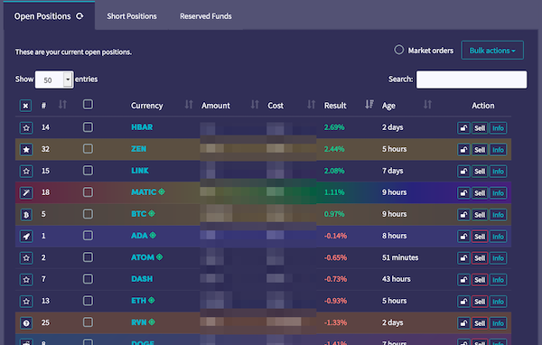
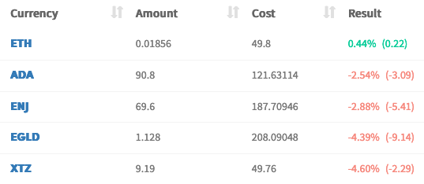
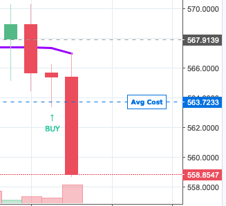
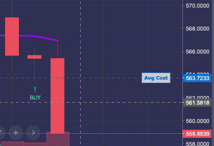
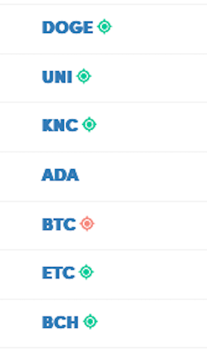
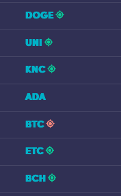
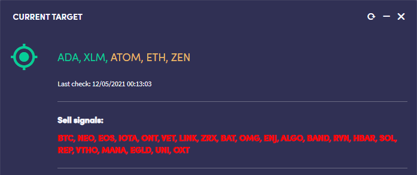
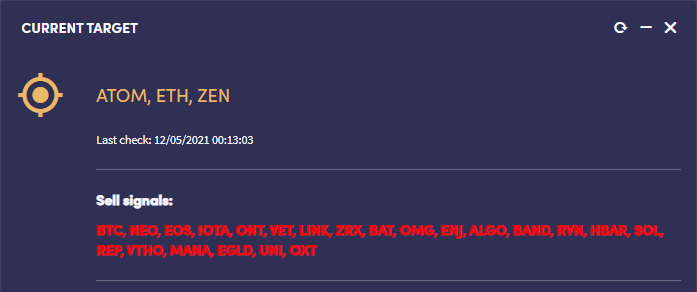

# A Set of User Scripts to Customize your Cryptohopper Experience
<!-- ALL-CONTRIBUTORS-BADGE:START - Do not remove or modify this section -->

<!-- ALL-CONTRIBUTORS-BADGE:END -->

This is a collection of userscripts that run on [cryptohopper.com](https://www.cryptohopper.com/?atid=16750) to enhance your experience. Each userscript focuses on one tweak or feature and can be run independent of the others. Run them all or just a few!

**What Is Cryptohopper?**

Cryptohopper is an algorithmic trading platform that interfaces with your crypto exchange to trade cryptocurrency on your behalf using market trends, signals, and strategies. It watches the market 24/7 and tries to determine the best time to enter a position and then sell at a predetermined profit target.

[Sign Up for Cryptohopper](https://www.cryptohopper.com/?atid=16750) (affiliate link)

**Motivation**

The Cryptohopper service is amazing! It has almost become an obsession of mine to watch the bot buy and sell all day long. Being a lifelong tweaker and optimizer, natually, I wanted to enhance the site with a few customizations that tailored my experience.

I created some of these scripts for personal use, and after sharing a few screenshots online I started getting requests for how others could do the same thing, leading me to make this project.

Since then multiple community members have contributed tweaks, fixes, testing efforts, and even entirely new scripts! I hope this repo can become a trusted community resource for those wishing to fine-tune their user experience in different ways.

## ⚠️ Security implications: ⚠️

> These scripts manipulate elements on a financial site while you are logged in. Please read and understand what the code is doing before you run it!

You are responsible for the code you run on your own computer. By downloading and executing this script you take responsibility for anything it may do, so please read and understand the code *before* installing it.

Cryptohopper may change their website at any moment, causing one or all of these scripts to cease functioning.

## all.user.js

> By [@markrickert](https://github.com/markrickert) and [@eatsleepcoderepeat-gl](https://github.com/eatsleepcoderepeat-gl) (Xerahn on Discord)

* This is a master script, provided for user convenience, which will install all other scripts available at the time of installation. If auto update is enabled, this will also keep all other scripts up to date as well and will add any new features (scripts) automatically. ⚠️ *If using this, there's no need to manually install individual scripts; any other installed scripts from this project should be uninstalled prior to using this script.*

## coin-watchlist.user.js

* Allows you to track a coin by icon/color across all your hoppers. Highlight the losers or mark positions that are heavily dollar cost averaged to more easily visually identify them in your dashboard or mark coins that are part of a custom config pool.
* Clear individual coin watches by cycling through the list in the Open Positions table.
* Clear all watchlist colors by clicking the `X` at the top of the new watchlist column.
* Adds row colors to the Last 5 Sells table and the trade history page.
* Looks great in light and dark mode!

|||
:-:|:-:
  |  

## absolute-value.user.js

> By [@eatsleepcoderepeat-gl](https://github.com/eatsleepcoderepeat-gl) (Xerahn on Discord)

* Adds an absolute value next to the percentage change on your open positions table.

|||
:-:|:-:
  |  

## chart-mods.user.js

* Adds your average price and last buy indicator to the Tradingview graph.

|||
:-:|:-:
  |  

> Note: Some users are served the chart on `chart/chart_tradingview.php` and this script will not work if your charts are loaded from there. It will only work on the `chart/chart.php` url.

## position-targets.user.js

* Puts a target icon next to each currency symbol when it is on the target buy/sell list for easier tracking of what the bot is recommending to buy or sell.

|||
:-:|:-:
  |  

> Note: This will also show targets that are hidden by default in the targets list.

## target-restore.user.js

> By [@henrygarle](https://github.com/henrygarle) (FaceWound on Discord)

* Restores targets list to match functionality removed on 2021-05-11. Any targets that would be shown by the default UI are shown in green, any that would normally be hidden are displayed in orange.

|||
:-:|:-:
  |  

## remove-hoppie.user.js

* Permanently hide hoppie's hand from poking out of the side of the screen.

## stay-level-headed.user.js

* Removes those pesky emotions and hides the panic button from the dashboard so you can't click it in a moment of weakness.

## multi-select.user.js

> By [@eatsleepcoderepeat-gl](https://github.com/eatsleepcoderepeat-gl) (Xerahn on Discord)

* Adds shift+click functionality for position checkboxes to allow selecting all positions of the same coin/token at once.

## export-saved-trade-history.user.js

> By [@eatsleepcoderepeat-gl](https://github.com/eatsleepcoderepeat-gl) (Xerahn on Discord)

* Adds single-click export functionality to the trade history page using the saved settings (after saving at least once), and allows for saving and loading export settings. The author of this script finds it useful to set the *to* part of the date range to sometime in the future when using this functionality, such as 01/01/2030 12:00 AM.

---

# Installation:

1. Select a user script you want from this repository.
1. Read through the script and familiarize yourself with the code. Make sure you understand what it does before you install it!
1. Click the "Raw" button and your browser extension should ask you to install it.
1. Navigate to your Cryptohopper dashboard.
1. 🤖💰🚀🌖
1. ...
1. (optional) You can turn on auto-updates to the script or check back here for new versions.

### Quick install links:

> If you already have TamperMonkey installed and know what you're dong:

#### All in one master script:
* [`all.user.js`](https://github.com/markrickert/cryptohopper-dashboard-watchlist/raw/main/all.user.js) ⚠️ *No need to install other scripts if using this one. Please uninstall all below scripts if using this.*

#### Individual scripts:
* [`coin-watchlist.user.js`](https://github.com/markrickert/cryptohopper-dashboard-watchlist/raw/main/coin-watchlist.user.js)
* [`absolute-value.user.js`](https://github.com/markrickert/cryptohopper-dashboard-watchlist/raw/main/absolute-value.user.js)
* [`chart-mods.user.js`](https://github.com/markrickert/cryptohopper-dashboard-watchlist/raw/main/chart-mods.user.js)
* [`position-targets.user.js`](https://github.com/markrickert/cryptohopper-dashboard-watchlist/raw/main/position-targets.user.js)
* [`target-restore.user.js`](https://github.com/markrickert/cryptohopper-dashboard-watchlist/raw/main/target-restore.user.js)
* [`remove-hoppie.user.js`](https://github.com/markrickert/cryptohopper-dashboard-watchlist/raw/main/remove-hoppie.user.js)
* [`stay-level-headed.user.js`](https://github.com/markrickert/cryptohopper-dashboard-watchlist/raw/main/stay-level-headed.user.js)
* [`multi-select.user.js`](https://github.com/markrickert/cryptohopper-dashboard-watchlist/raw/main/multi-select.user.js)
* [`export-saved-trade-history.user.js`](https://github.com/markrickert/cryptohopper-dashboard-watchlist/raw/main/export-saved-trade-history.user.js)

# Donate

If you enjoy using these scripts and would like to donate to help fund further development you can tip with the Brave Browser in BAT or send to any of these addresses:

> BAT: 0x23d89970B883DEA62e74AeFdf5B0d739e91A0292

> BTC: 3DK79sPwBoguNd1b3Et2c3WdWzxfjwxBpj

> ETH: 0xbb475E8B86c945c30EED650858949b475BE5f970

> ALGO: TQJC62XSTKUU4BVFUKMREOVB4EZYYAQQBSKVTBBPQTQQJXBXGROTMFAZ3Q

> ADA: addr1vxt8feadqlal6tx2udemvwm2pgm95ne3n68zlkx5v2uucdc4atcz7

# Other great Cryptohopper userscripts:

* [coffeeneer/cryptohopper_scripts](https://github.com/coffeeneer/cryptohopper_scripts)

# Contributing

New ideas are always welcome! Please open a github ticket with your idea and maybe we can make it a reality! Contributions and pull requests are always welcome!

## Contributors ✨

Thanks goes to these wonderful people ([emoji key](https://allcontributors.org/docs/en/emoji-key)):

<!-- ALL-CONTRIBUTORS-LIST:START - Do not remove or modify this section -->
<!-- prettier-ignore-start -->
<!-- markdownlint-disable -->
<table>
  <tr>
    <td align="center"><a href="https://github.com/eatsleepcoderepeat-gl"> <b>eatsleepcoderepeat-gl</b></a> <a href="https://github.com/markrickert/cryptohopper-dashboard-watchlist/commits?author=eatsleepcoderepeat-gl" title="Code">💻</a> <a href="#ideas-eatsleepcoderepeat-gl" title="Ideas, Planning, & Feedback">🤔</a></td>
    <td align="center"><a href="https://github.com/HenryGarle"> <b>henrygarle</b></a> <a href="#ideas-HenryGarle" title="Ideas, Planning, & Feedback">🤔</a> <a href="https://github.com/markrickert/cryptohopper-dashboard-watchlist/commits?author=HenryGarle" title="Code">💻</a></td>
  </tr>
</table>

<!-- markdownlint-restore -->
<!-- prettier-ignore-end -->

<!-- ALL-CONTRIBUTORS-LIST:END -->

This project follows the [all-contributors](https://github.com/all-contributors/all-contributors) specification. Contributions of any kind welcome!
---

> This project is not affiliated, associated, authorized, endorsed by, or in any way officially connected with Cryptohopper.com, or any of its subsidiaries or its affiliates.

> The Cryptohopper name as well as related marks, emblems and images are registered trademarks of Cryptohopper.com.
