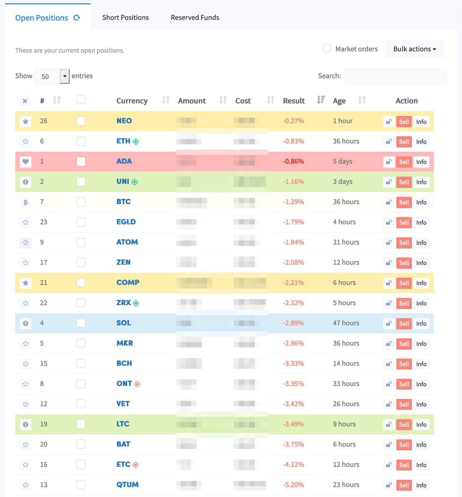
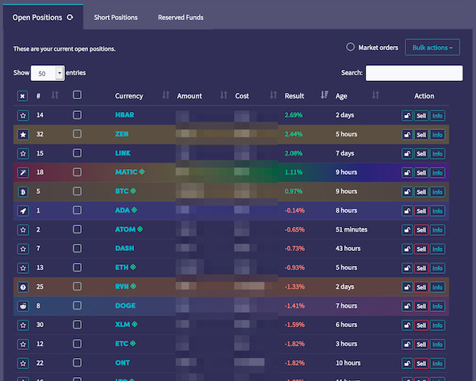

# cryptohopper-dashboard-watchlist

This is a small userscript that runs in your browser extension adding the ability to "watch" certain coins in your dashboard easier by assigning an icon and changing the background color. This allows you to track each coin over multiple hoppers with ease.

## Features:

* Allows you to track a coin by icon/color across all your hoppers. Highlight the losers or mark positions that are heavily dollar cost averaged to more easily visually identify them in your dashboard or mark coins that are part of a custom config pool.
* Clear individual coin watches by cycling through the list in the Open Positions table.
* Clear all watchlist colors by clicking the `X` at the top of the new watchlist column.
* Adds row colors to the Last 5 Sells table and the trade history page.
* Looks great in light and dark mode!

### Other Small Tweaks:

> All these features are flagged so you can easily turn them off:

* Puts a target icon next to each currency symbol when it is on the target buy/sell list for easier tracking of what the bot is recommending to buy or sell.
* Removes the column full of checkboxes.
* Permanently hide hoppie's hand from poking out of the side of the screen.

# ⚠️ Security implications: ⚠️

> This is a script that manipulates elements on a financial site while you are logged in. Please read and understand what the code is doing before you run it!

You are responsible for the code you run on your own computer. By downloading and executing this script you take responsibility for anything it may do, so please read and understand the code *before* installing it.

# See it in action!

Light Mode             |  Dark Mode
:-------------------------:|:-------------------------:
  |  

# Installation:

1. **Read and understand exactly what this script is doing.**
2. Install a userscript extension in your browser like [TamperMonkey](https://www.tampermonkey.net/).
3. Click on the Tampermonkey browser extension and select `Create a new script...`
4. After reading the script and understanding what it does, click the "Raw" button and your browser extension should ask you to install it. You can also click this link: [`cryptohopper-dashboard-watchlist.user.js`](cryptohopper-dashboard-watchlist.user.js).
5. Navigate to your Cryptohopper dashboard.
6. 🤖💰🚀🌖
7. ...
8. You can turn on auto-updates to the script or check back here for new versions.

# Editing the script's behavior:

All of the icons and colors can be customized in the script. Feel free to modify colors to your liking and add/remove watchlist statuses in the `WATCHLIST_STATUSES` var.

# Roadmap:

1. Add trend indicators to positions.
2. An overlay interface that allows you to customize status icons/colors.

---

> This project is not affiliated, associated, authorized, endorsed by, or in any way officially connected with Cryptohopper.com, or any of its subsidiaries or its affiliates.

> The Cryptohopper name as well as related marks, emblems and images are registered trademarks of Cryptohopper.com.

